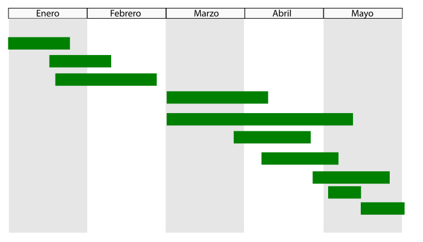

Herramientas
-----------------------------------------------------------------------

Diagramas de Gantt
^^^^^^^^^^^^^^^^^^^^^^^^^^^^^^^^^^^^^^^^^^^^^^^^^^^^^^^^^^^^^^^^^^^^^^^

.. index:: gantt (diagrama de)

El **diagrama de Gantt** es una herramienta gráfica cuyo objetivo es
exponer el tiempo de dedicación previsto para diferentes tareas o
actividades a lo largo de un tiempo total determinado. 

El diagrama está compuesto por un eje vertical donde se establecen las
actividades que constituyen el trabajo que se va a ejecutar, y un eje
horizontal que muestra en un calendario la duración de cada una de
ellas.

Los diagramas de Gantt no muestran en principio las relaciones
existentes entre actividades, aunque de la posición que ocupa cada
actividad a lo largo del tiempo se pueda deducir cierto orden de
prioridades.

Por esto, para la planificación del proyectos complejos (superiores a 25
actividades) se recomienda el uso de técnicas basadas en redes de
precedencia como CPM o los diagramas PERT. Estas redes relacionan las
actividades de manera que se pueda visualizar el camino crítico del
proyecto (es decir, la actividad más compleja o la que demandará más
tiempo) y permiten reflejar una escala de tiempos para facilitar la
asignación de recursos y la determinación del presupuesto.

El diagrama de Gantt, con todo, sí resulta útil para establecer una
relación básica entre tiempo y carga de trabajo. 

Técnicas PERT
^^^^^^^^^^^^^^^^^^^^^^^^^^^^^^^^^^^^^^^^^^^^^^^^^^^^^^^^^^^^^^^^^^^^^^^
.. index:: PERT

**PERT** (Del inglés *Program Evaluation and Review Techniques*, Técnica
de Revisión y Evaluación de Proyectos) es una técnica estadística de la
administración y gestión de proyectos que fue diseñada para analizar y
representar las tareas involucradas en culminar un proyecto.

Una gráfica PERT es un grafo o diagrama compuesto de nodos y arcos. 
Cada nodo representa un *evento* o un momento en el tiempo.
Estos se conectan con arcos que represetan las tareas de proyecto. El
arco debe indicar la longitud estimada de la tarea, en unidades de
tiempo, ya sea mediante su longitud, o bien con una etiqueta.
